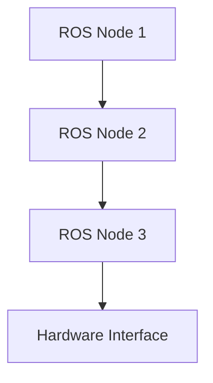

# Chapter Template

This is a template for creating consistent documentation chapters in the Physical AI & Humanoid Robotics book.

## Learning Objectives

By the end of this chapter, you should be able to:
- Objective 1
- Objective 2
- Objective 3

## Prerequisites

Before starting this chapter, you should:
- Have completed previous chapters (if applicable)
- Have the required hardware/software setup
- Understand the fundamental concepts covered in earlier parts

## Introduction

Provide an overview of what this chapter covers and why it's important in the context of Physical AI and humanoid robotics.

## Main Content

### Section 1

Detailed explanation of the first topic.

### Section 2

Detailed explanation of the second topic.

### Code Examples

```python
# Example code relevant to this chapter
def example_function():
    """
    Brief description of the function
    """
    pass
```

## ROS Diagram



## Summary

Brief summary of key points covered in this chapter.

## Next Steps

What the reader should do next, either practically or by moving to the next chapter.

## Exercises/Challenges

1. Exercise 1
2. Exercise 2