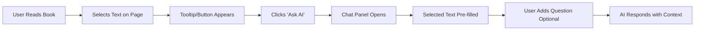

## Prompt

alr moving on to the next phase. name the new branch "004-text-selection" # Text Selection to Chat Feature - Implementation Prompt

> **Feature:** Allow users to select text from book content and send it directly to the AI chatbot
> **Context:** Docusaurus-based book reader with RAG chatbot integration
> **Created:** December 10, 2025

---

## Feature Overview

This feature enables users to:
1. **Select any text** from the book content (Markdown documentation pages)
2. **Click a context button** (e.g., "Ask AI about this")
3. **Automatically open the chatbot** with the selected text as context
4. **Receive AI responses** that use both the selected text and RAG-retrieved context from the vector database

---

## User Experience Flow



---

### Create Text Selection Detection Hook

```
Create a custom React hook in test-docs/src/components/TextSelection/useTextSelection.tsx that:

1. Listens for text selection events using window.getSelection()
2. Detects when the user selects text (mouseup event)
3. Returns the selected text and position coordinates
4. Ignores selections within the chat widget itself
5. Clears selection state when text is deselected
6. Implements debouncing to avoid excessive re-renders

Requirements:
- TypeScript with proper type definitions
- Return object with: { selectedText: string, position: { x: number, y: number }, hasSelection: boolean }
- Clean up event listeners on unmount
- Handle edge cases (empty selections, multi-element selections)
```

---

###  Build Selection Popup Component

```
Create a SelectionPopup component in test-docs/src/components/TextSelection/SelectionPopup.tsx that:

1. Appears near the selected text (using absolute positioning)
2. Shows a button with text "Ask AI about this" and a sparkle/AI icon
3. Fades in with smooth animation (0.2s ease-in)
4. Positions itself dynamically based on selection coordinates
5. Handles clicks to trigger the chat widget
6. Closes when user clicks elsewhere or deselects text
7. Uses glassmorphism design matching your existing chat widget style

Styling Requirements:
- Backdrop blur effect (backdrop-filter: blur(10px))
- Semi-transparent background with border
- Smooth transitions and hover effects
- Responsive positioning (avoid going off-screen)
- Z-index high enough to appear above content but below modals

Props:
- selectedText: string
- position: { x: number, y: number }
- onAskAI: (text: string) => void
- onClose: () => void
```

---

### Integrate Selection Handler with Docusaurus

```
Swizzle (customize) the Docusaurus DocItem component to integrate text selection:

1. Create test-docs/src/theme/DocItem/index.tsx as a wrapper
2. Import the useTextSelection hook and SelectionPopup component
3. Wrap the default DocItem content with selection detection
4. Show SelectionPopup when text is selected
5. Connect to ChatBot component to open with selected text
6. Use Docusaurus's swizzle command: npm run swizzle @docusaurus/theme-classic DocItem -- --wrap

Implementation:
- Keep the default DocItem behavior intact
- Add selection overlay that doesn't interfere with reading
- Ensure proper React context for ChatBot communication
- Handle mobile/tablet devices (optional: show on long-press)
```

---

### Update ChatBot Component for Selected Text

```
Modify test-docs/src/components/ChatBot/index.tsx to:

1. Accept a new prop: initialSelectedText?: string
2. Add a state variable for selected text context
3. Create an openWithSelection(text: string) method that:
   - Opens the chat panel if closed
   - Pre-fills the input OR shows the selected text as a "context card"
   - Optionally auto-sends the message with prompt: "Explain this: [selected text]"
   - Focuses the input field for user to add their question

4. Implement a global method or context provider to allow other components to trigger chat with text
5. Display the selected text prominently in the UI (e.g., as a quoted block above the input)
6. Add a close button on the context card to remove selected text

UI Design:
- Show selected text in a card with light background
- Add label "Selected from book:" above the text
- Include a "Clear" button to remove the context
- Ensure it's visually distinct from chat messages
```

---

### Backend RAG Endpoint Enhancement

```
Update backend/src/backend/main.py to properly handle the selected_text parameter:

Current endpoint: POST /api/chat
Request body: { user_query: string, selected_text?: string, chat_history?: [] }

Enhancements needed:

1. When selected_text is provided:
   - Use it as additional context in the RAG pipeline
   - Generate embedding for BOTH user_query AND selected_text
   - Boost relevance of vector search results that match selected_text topic
   - Include selected_text in the system prompt as "User is asking about this specific passage"

2. Modify the OpenAI Agents SDK agent creation to:
   - Accept dynamic system prompts
   - Prioritize selected_text context over generic RAG results
   - Return metadata indicating if selected_text was used

3. Response format:
   {
     "output": "AI response text",
     "context_chunks": [...],
     "sources": [...],
     "used_selected_text": true/false
   }

4. Add guardrails to ensure responses stay relevant to selected_text when provided
```

---

### Styling and User Experience Polish

```
Apply premium design to the text selection feature:

1. SelectionPopup.tsx styling:
   - Use vibrant gradient for the button background
   - Add subtle shadow and glow effect
   - Implement micro-animations (scale up on hover, pulse effect)
   - Make it feel modern and premium (avoid generic Material UI look)

2. ChatBot selected text context card:
   - Glassmorphism effect matching the chat widget
   - Smooth fade-in animation when displayed
   - Typography: use a serif font for the selected quote to differentiate from chat messages
   - Add a subtle left border or quotation mark icon

3. Interaction feedback:
   - Button ripple effect on click
   - Loading state while AI processes the query
   - Success feedback (e.g., checkmark) when message is sent

4. Responsive design:
   - Mobile: Show selection popup as a bottom sheet instead of tooltip
   - Tablet: Adjust positioning for landscape/portrait
   - Desktop: Tooltip near cursor position

Use your existing ChatBot.module.css patterns for consistency.
```

---

### Testing and Debugging

```
Create a comprehensive test plan for the text selection feature:

Manual Testing Checklist:
1. ✅ Select text on a documentation page
2. ✅ Verify popup appears near selection
3. ✅ Click "Ask AI" button and confirm chat opens
4. ✅ Check that selected text appears in chat context
5. ✅ Send a question and verify AI response uses the selected text
6. ✅ Test with different selection lengths (short, medium, long)
7. ✅ Test selecting across multiple paragraphs
8. ✅ Test deselection behavior (popup should disappear)
9. ✅ Test clicking outside popup (should close gracefully)
10. ✅ Test with chat already open (should add context to existing conversation)

Edge Cases to Handle:
- Selecting text inside code blocks
- Selecting text that includes images or links
- Selecting text from tables
- Mobile long-press selection
- Selection while chat widget is minimized
- Rapid multiple selections
- Empty or whitespace-only selections

Debugging Commands:
- Start backend: cd backend && uv run uvicorn src.backend.main:app --reload
- Start frontend: cd test-docs && npm start
- Check browser console for errors
- Verify selected_text is sent in network request payload
```

---

## Technical Implementation Details

### Text Selection Logic (Browser API)

```javascript
// Pseudo-code for selection detection
window.addEventListener('mouseup', () => {
  const selection = window.getSelection();
  const text = selection?.toString().trim();

  if (text && text.length > 0) {
    const range = selection.getRangeAt(0);
    const rect = range.getBoundingClientRect();

    // Set state: { selectedText: text, position: { x: rect.x, y: rect.y } }
  }
});
```

### RAG Context Augmentation

When `selected_text` is provided, the backend should:

1. **Query Construction:**
   ```python
   if selected_text:
       augmented_query = f"{user_query}\n\nContext: {selected_text}"
   else:
       augmented_query = user_query
   ```

2. **System Prompt Enhancement:**
   ```python
   system_prompt = f"""You are an AI assistant helping users understand book content.

   The user has selected this specific text from the book:
   \"\"\"{selected_text}\"\"\"

   Use this as the primary context for your response. Also consider the following
   relevant sections from the book: {rag_context}

   Answer the user's question clearly and specifically reference the selected text.
   """
   ```

3. **Embedding Strategy:**
   - Generate separate embeddings for selected_text and user_query
   - Perform hybrid search combining both
   - Boost results semantically similar to selected_text


---

## Environment Variables

No new environment variables needed. The feature uses existing:
- `GEMINI_API_KEY` (for embeddings and LLM)
- `QDRANT_URL` and `QDRANT_API_KEY` (for RAG search)

---

## Expected Behavior Summary

1. **User selects text** → Popup appears instantly
2. **User clicks "Ask AI"** → Chat opens with selected text visible as context
3. **User can add their question** → Or the system auto-generates one like "Explain this passage"
4. **AI processes request** → Uses selected text + RAG context from Qdrant
5. **Response is contextual** → Directly addresses the selected passage with supporting information

---

## Response snapshot

Created a new feature branch named "004-text-selection" and generated a comprehensive specification document for the text selection to chat feature. The specification includes:

- User scenarios and testing requirements
- Functional requirements (FR-001 to FR-010)
- Key entities (SelectedText, SelectionPopup, ChatContext)
- Success criteria (SC-001 to SC-005)
- Edge cases handling

The feature enables users to select text from book content and send it directly to the AI chatbot with proper context integration. A requirements checklist was also created to validate the specification quality.

## Outcome

- ✅ Impact: Created complete feature specification for text selection functionality
- 🧪 Tests: No automated tests run yet
- 📁 Files: specs/004-text-selection/spec.md, specs/004-text-selection/checklists/requirements.md
- 🔁 Next prompts: Ready for planning phase with /sp.plan
- 🧠 Reflection: Specification is comprehensive and ready for implementation planning

## Evaluation notes (flywheel)

- Failure modes observed: None
- Graders run and results (PASS/FAIL): N/A
- Prompt variant (if applicable): N/A
- Next experiment (smallest change to try): Begin implementation planning with /sp.plan
