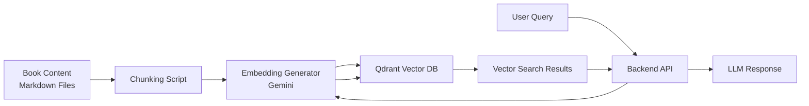

# Feature Specification: Qdrant Vector Database Integration

**Feature Branch**: `001-qdrant-integration`
**Created**: 2025-12-08
**Status**: Draft
**Input**: User description: "now lets move on to the next phase: # Qdrant Vector Database Integration Specs

> **Purpose:** Step-by-step prompts for integrating Qdrant vector database with book content
> **Context:** Following the structure of the current project (frontend, backend, auth-server)

---

## 🔧 Backend Package Manager: UV

The backend is built using uv, a fast Python package manager and resolver. All backend dependencies must be installed using the `uv` command.

### Required Package Installations

Navigate to the `backend/` directory and install the following packages:

```bash
cd backend

# Core Framework
uv add fastapi
uv add uvicorn

# AI & Embeddings
uv add openai-agents
uv add openai
uv add google-generativeai

# Vector Database
uv add qdrant-client

# Database & Authentication
uv add psycopg2
uv add pyjwt
uv add passlib
uv add bcrypt

# Utilities
uv add python-dotenv
```

### Complete Dependencies List

| Package | Version | Purpose |
|---------|---------|---------|
| `fastapi` | ≥0.122.0 | Web framework for building APIs |
| `uvicorn` | ≥0.38.0 | ASGI server for FastAPI |
| `openai-agents` | ≥0.6.1 | Agent framework with guardrails |
| `openai` | ≥1.59.6 | OpenAI API client |
| `google-generativeai` | ≥0.8.5 | Google Gemini API for embeddings & LLM |
| `qdrant-client` | ≥1.16.1 | Vector database client |
| `psycopg2` | ≥2.9.11 | PostgreSQL database adapter |
| `pyjwt` | ≥2.8.0 | JWT token handling |
| `passlib` | ≥1.7.4 | Password hashing utilities |
| `bcrypt` | ≥4.1.2 | Password hashing algorithm |
| `python-dotenv` | ≥1.0.0 | Environment variable management |

---

## 1. Overview

### Project Context

We have successfully created a book with content in our frontend. Now we need to:
1. Set up Qdrant vector database connection
2. Process and chunk the book content
3. Generate embeddings for the content
4. Ingest the content into Qdrant
5. Implement vector search for RAG queries

### Architecture



### Technology Stack

- **Vector Database:** Qdrant Cloud
- **Embeddings:** Google Gemini `text-embedding-004` (768-dim)
- **Backend:** Python 3.12+ with FastAPI
- **Client Library:** `qdrant-client` 1.16.1+

---

## 2. Project Structure

Our project has the following structure:

```
project/
├── frontend/                    # Docusaurus frontend
│   └── docs/                    # Book content (Markdown files)
│
├── backend/                     # Python FastAPI backend
│   ├── backend/                 # Core logic modules
│   │   ├── database.py          # DB & Qdrant clients, embeddings
│   │   └── ingest.py            # Document ingestion script
│   │
│   ├── src/backend/             # Main application
│   │   └── main.py              # FastAPI app with API endpoints
│   │
│   ├── .env                     # Environment variables
│   └── pyproject.toml           # Python dependencies (uv format)
│
└── auth-server/                 # Node.js authentication server
```

---

## 3. Prompts for Claude Code

Use these prompts in your Claude Code environment to set up the Qdrant integration:

### Prompt 1: Setup Database Client

```
Create a database.py file in backend/backend/ that:
1. Initializes Qdrant client using environment variables QDRANT_URL and QDRANT_API_KEY
2. Configures Google Gemini for embeddings using GEMINI_API_KEY
3. Implements get_embedding(text, task_type) function that returns 768-dim vectors using model text-embedding-004
4. Implements initialize_collection(collection_name) that creates a Qdrant collection with cosine distance
5. Add proper error handling and type hints

Use these imports:
- qdrant_client
- google.generativeai
- dotenv
```

---

### Prompt 2: Create Ingestion Script

```
Create an ingestion script backend/backend/ingest.py that:
1. Accepts --docs_path argument for the book content directory
2. Walks through all .md files recursively
3. Chunks each file into 1000-character segments with 200-char overlap
4. Generates embeddings for each chunk using the get_embedding function from database.py
5. Uploads all chunks to Qdrant collection "book_content" with metadata:
   - filename (relative path)
   - text (chunk content)
   - chunk_number (position)
   - total_chunks (total in document)
6. Shows progress with print statements
7. Handles errors gracefully

Make it runnable with: uv run backend/ingest.py --docs_path ../frontend/docs
```

---

### Prompt 3: Implement RAG Endpoint

> ⚠️ **Important:** The RAG AI must be built using the **OpenAI Agents SDK**.
> Before writing this code, use the skill: `openai-agents-sdk`

```
Use your openai-agents-sdk skill to implement the RAG system.

In backend/src/backend/main.py, add a RAG chat endpoint using OpenAI Agents SDK that:
1. Creates an Agent with Gemini model via OpenAI-compatible API
2. Accepts POST /api/chat with body: {user_query, selected_text?, chat_history?}
3. Generates query embedding using Gemini text-embedding-004
4. Searches Qdrant for top 5 relevant chunks (score_threshold=0.7)
5. Builds context from search results
6. Uses Agent with augmented system prompt containing the context
7. Implements guardrails for content safety and topic relevance
8. Returns {output, context_chunks, sources}

Also add a GET /api/search endpoint for direct vector search.
Include proper error handling and CORS configuration.
```

---

### Prompt 4: Create Test Suite

```
Create backend/backend/test_qdrant.py with test functions for:
1. test_connection() - verify Qdrant connectivity
2. test_embedding() - test embedding generation
3. test_upsert() - test uploading test point
4. test_search() - test vector search

Each test should print clear success/failure messages.
Make it runnable with: uv run backend/test_qdrant.py
```

---

### Prompt 5: Environment Configuration

```
Update backend/.env with:
1. QDRANT_URL (Qdrant Cloud cluster URL)
2. QDRANT_API_KEY (API key from Qdrant Cloud)
3. GEMINI_API_KEY (Google AI API key)
4. QDRANT_COLLECTION_NAME=book_content
5. SEARCH_LIMIT=5
6. SCORE_THRESHOLD=0.7
7. CHUNK_SIZE=1000
8. CHUNK_OVERLAP=200
```

---

### Prompt 6: Frontend Integration

```
In frontend/src/components/ChatBot/index.tsx:
1. Update the chat API call to include selected_text parameter
2. Display source citations from the response
3. Show number of context chunks used
4. Add loading state during RAG processing
5. Handle errors gracefully

The API endpoint is: http://localhost:8000/api/chat
```

---

### Prompt 7: Run Complete Workflow

```
Help me run the complete Qdrant integration workflow:
1. Verify all environment variables are set in backend/.env
2. Test Qdrant connection
3. Run ingestion script on my book content directory: uv run  backend/ingest.py --docs_path ../frontend/docs
4. Verify collection was created successfully
5. Test RAG endpoint with sample query
6. Start backend server: uv run uvicorn src.backend.main:app --reload
7. Test from frontend

Guide me through each step with verification commands.
```

---

## 4. Environment Variables

Required environment variables for `backend/.env`:

```env
# Qdrant Cloud Configuration
QDRANT_URL=https://your-cluster.qdrant.cloud:6333
QDRANT_API_KEY=your_qdrant_api_key

# Google Gemini API
GEMINI_API_KEY=your_gemini_api_key

# Collection Settings
QDRANT_COLLECTION_NAME=book_content

# RAG Settings
SEARCH_LIMIT=5
SCORE_THRESHOLD=0.7
CHUNK_SIZE=1000
CHUNK_OVERLAP=200
```

---

## 5. Troubleshooting

### Common Issues

| Issue | Error | Solution |
|-------|-------|----------|
| Connection Refused | `Cannot connect to Qdrant` | Verify QDRANT_URL format and API key |
| Dimension Mismatch | `Vector dimension mismatch` | Ensure collection uses 768 dimensions for Gemini |
| Slow Ingestion | Takes too long | Use batch uploads, reduce chunk size |
| Poor Search Results | Irrelevant context | Lower score_threshold, increase search limit |

---

## 6. Next Steps

After completing Qdrant integration:

1. ✅ Test End-to-End RAG Flow
2. ✅ Optimize Search Parameters
3. ✅ Add Advanced Features (metadata filtering, hybrid search)
4. ✅ Implement Monitoring
5. ✅ Production Deployment

---

**End of Qdrant Integration Specs**

> 💡 **Tip:** Work through prompts sequentially. Each prompt builds on previous steps."

## User Scenarios & Testing *(mandatory)*

### User Story 1 - Access Book Content via RAG Chat (Priority: P1)

As a user of the book application, I want to ask questions about the book content and receive accurate, contextually relevant responses that include citations to the source material. The system should understand my query, search through the book content, and provide answers based on the actual book text with proper attribution.

**Why this priority**: This is the core value proposition of the RAG system - enabling users to interact with the book content through natural language queries, which is the primary use case for the feature.

**Independent Test**: Can be fully tested by submitting queries to the chat endpoint and verifying that responses are generated from the book content with proper citations, delivering the core RAG functionality.

**Acceptance Scenarios**:

1. **Given** the book content has been ingested into the vector database, **When** a user submits a question about the book content, **Then** the system returns an accurate response based on the book content with source citations
2. **Given** a user submits a query that matches book content, **When** the RAG system processes the query, **Then** the response includes relevant excerpts and source references to specific documents/chunks

---

### User Story 2 - Search Book Content Directly (Priority: P2)

As a user, I want to be able to perform direct vector searches on the book content to find specific information without going through a chat interface. This allows me to see relevant sections of the book based on semantic similarity to my search query.

**Why this priority**: Provides an alternative interaction method for users who prefer search over chat, and serves as a foundation for the RAG functionality.

**Independent Test**: Can be tested by calling the search endpoint directly with various queries and verifying that semantically relevant book content is returned.

**Acceptance Scenarios**:

1. **Given** book content is stored in the vector database, **When** a user performs a vector search, **Then** the system returns the most relevant book content chunks based on semantic similarity

---

### User Story 3 - View Source Citations (Priority: P3)

As a user, I want to see clear citations indicating where the information in the response came from, so I can verify the accuracy and reference the original content.

**Why this priority**: Builds trust in the system by showing the provenance of information, allowing users to verify responses against the source material.

**Independent Test**: Can be tested by verifying that responses include metadata about the source documents/chunks that contributed to the answer.

**Acceptance Scenarios**:

1. **Given** a RAG response is generated, **When** the response is displayed to the user, **Then** it includes clear citations showing which documents/chunks were used as context

---

### Edge Cases

- What happens when the vector database is temporarily unavailable during a query?
- How does the system handle queries when no relevant content is found in the book?
- What occurs when the book content contains special characters or formatting that affects chunking?
- How does the system respond when the embedding generation service is rate-limited or unavailable?
- What happens if the book content is extremely large and exceeds memory limits during processing?

## Requirements *(mandatory)*

### Functional Requirements

- **FR-001**: System MUST connect to Qdrant vector database using provided URL and API key
- **FR-002**: System MUST generate embeddings for text content using Google Gemini text-embedding-004 model
- **FR-003**: System MUST chunk book content into 1000-character segments with 200-character overlap
- **FR-004**: System MUST store book content chunks in Qdrant collection with appropriate metadata (filename, text, chunk number, total chunks)
- **FR-005**: System MUST accept user queries and convert them to embeddings for vector search
- **FR-006**: System MUST perform vector search in Qdrant and return top 5 most relevant chunks
- **FR-007**: System MUST filter search results using score threshold of 0.7
- **FR-008**: System MUST generate responses using OpenAI Agents SDK with augmented context from search results
- **FR-009**: System MUST include source citations in responses showing which documents contributed to the answer
- **FR-010**: System MUST provide a direct vector search endpoint for semantic search functionality
- **FR-011**: System MUST implement content safety and topic relevance guardrails in the RAG pipeline
- **FR-012**: System MUST handle errors gracefully and provide meaningful error messages to users
- **FR-013**: System MUST process all .md files recursively from the specified documentation directory

### Key Entities

- **Book Content Chunk**: A segment of book text (up to 1000 characters) with metadata including source filename, chunk position, and total chunks in document
- **Vector Embedding**: A 768-dimensional numerical representation of text content that enables semantic similarity search
- **Qdrant Collection**: A container in the vector database storing book content chunks with their embeddings and metadata
- **RAG Response**: A generated response that includes both the answer to user query and citations to source documents

## Success Criteria *(mandatory)*

### Measurable Outcomes

- **SC-001**: Users can submit queries about book content and receive relevant responses with source citations within 5 seconds
- **SC-002**: The system successfully ingests 100% of .md files from the documentation directory without errors
- **SC-003**: Search accuracy is sufficient that 90% of returned results are relevant to the user's query intent
- **SC-004**: The system maintains 99% uptime for the RAG chat functionality during normal operation
- **SC-005**: Response generation includes proper source citations for 100% of RAG responses
- **SC-006**: The ingestion process can handle book content of at least 100,000 characters without performance degradation